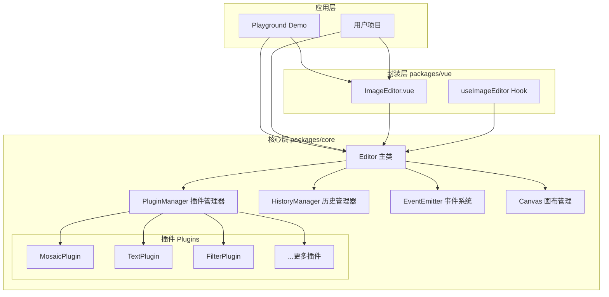

# 设计文档

## 概述

图片编辑器插件采用分层架构设计，核心层（Core）使用原生 JavaScript 实现所有编辑功能，Vue 封装层提供框架集成。整体设计遵循以下原则：

- **零依赖**：Core 层不依赖任何第三方库
- **插件化**：所有编辑功能以插件形式实现，支持按需加载
- **可扩展**：统一的插件接口，方便添加新功能
- **跨平台**：同时支持 PC 鼠标操作和移动端触摸操作

## 架构

### 整体架构图



### 目录结构

```
packages/
├── core/                                    # 核心库 (@image-editor/core)
│   ├── src/
│   │   ├── index.ts                        # 主入口，导出所有公共 API
│   │   ├── core/                           # 核心模块
│   │   │   ├── index.ts                    # 核心模块入口
│   │   │   ├── Editor.ts                   # Editor 主类
│   │   │   ├── Canvas.ts                   # Canvas 画布管理
│   │   │   └── Layer.ts                    # 图层管理
│   │   ├── managers/                       # 管理器模块
│   │   │   ├── index.ts                    # 管理器入口
│   │   │   ├── PluginManager.ts            # 插件管理器
│   │   │   ├── HistoryManager.ts           # 历史记录管理器
│   │   │   ├── EventManager.ts             # 事件管理器
│   │   │   └── ConfigManager.ts            # 配置管理器
│   │   ├── plugins/                        # 内置插件
│   │   │   ├── index.ts                    # 插件入口，支持按需导入
│   │   │   ├── base/                       # 插件基类
│   │   │   │   ├── index.ts
│   │   │   │   └── BasePlugin.ts           # 插件抽象基类
│   │   │   ├── mosaic/                     # 马赛克插件
│   │   │   │   ├── index.ts
│   │   │   │   ├── MosaicPlugin.ts
│   │   │   │   └── mosaic.utils.ts         # 马赛克算法工具
│   │   │   ├── text/                       # 文字插件
│   │   │   │   ├── index.ts
│   │   │   │   ├── TextPlugin.ts
│   │   │   │   ├── TextLayer.ts            # 文字图层
│   │   │   │   └── text.utils.ts           # 文字渲染工具
│   │   │   └── filter/                     # 滤镜插件
│   │   │       ├── index.ts
│   │   │       ├── FilterPlugin.ts
│   │   │       └── filters/                # 滤镜算法
│   │   │           ├── index.ts
│   │   │           ├── brightness.ts
│   │   │           ├── contrast.ts
│   │   │           ├── saturation.ts
│   │   │           ├── blur.ts
│   │   │           └── grayscale.ts
│   │   ├── utils/                          # 工具函数
│   │   │   ├── index.ts
│   │   │   ├── dom.utils.ts                # DOM 操作工具
│   │   │   ├── image.utils.ts              # 图片处理工具
│   │   │   ├── event.utils.ts              # 事件处理工具
│   │   │   ├── device.utils.ts             # 设备检测工具
│   │   │   └── export.utils.ts             # 导出工具
│   │   ├── types/                          # 类型定义
│   │   │   ├── index.ts                    # 类型入口
│   │   │   ├── editor.types.ts             # 编辑器类型
│   │   │   ├── plugin.types.ts             # 插件类型
│   │   │   ├── event.types.ts              # 事件类型
│   │   │   └── config.types.ts             # 配置类型
│   │   └── constants/                      # 常量定义
│   │       ├── index.ts
│   │       ├── defaults.ts                 # 默认配置
│   │       └── events.ts                   # 事件名称常量
│   ├── __tests__/                          # 测试文件
│   │   ├── unit/                           # 单元测试
│   │   │   ├── Editor.test.ts
│   │   │   ├── PluginManager.test.ts
│   │   │   └── HistoryManager.test.ts
│   │   └── property/                       # 属性测试
│   │       ├── editor.property.test.ts
│   │       ├── history.property.test.ts
│   │       └── filter.property.test.ts
│   ├── package.json
│   ├── tsconfig.json
│   ├── tsconfig.build.json
│   ├── vite.config.ts                      # 构建配置
│   └── README.md
│
├── vue/                                     # Vue 封装 (@image-editor/vue)
│   ├── src/
│   │   ├── index.ts                        # 主入口
│   │   ├── components/                     # Vue 组件
│   │   │   ├── index.ts                    # 组件入口
│   │   │   ├── ImageEditor/                # 主编辑器组件
│   │   │   │   ├── index.ts
│   │   │   │   ├── ImageEditor.vue         # 组件实现
│   │   │   │   └── ImageEditor.types.ts    # 组件类型
│   │   │   └── Toolbar/                    # 工具栏组件（可选）
│   │   │       ├── index.ts
│   │   │       ├── Toolbar.vue
│   │   │       └── Toolbar.types.ts
│   │   ├── composables/                    # Composition API
│   │   │   ├── index.ts
│   │   │   ├── useImageEditor.ts           # 编辑器 Hook
│   │   │   └── useEditorEvents.ts          # 事件 Hook
│   │   ├── directives/                     # Vue 指令（可选）
│   │   │   └── index.ts
│   │   └── types/                          # Vue 相关类型
│   │       ├── index.ts
│   │       └── props.types.ts
│   ├── __tests__/                          # 测试文件
│   │   ├── components/
│   │   │   └── ImageEditor.test.ts
│   │   └── composables/
│   │       └── useImageEditor.test.ts
│   ├── package.json
│   ├── tsconfig.json
│   ├── vite.config.ts
│   └── README.md
│
└── playground/                              # 演示项目
    ├── src/
    │   ├── main.ts                         # 应用入口
    │   ├── App.vue                         # 根组件
    │   ├── router/                         # 路由配置
    │   │   └── index.ts
    │   ├── views/                          # 页面视图
    │   │   ├── HomeView.vue                # 首页
    │   │   ├── NativeDemo/                 # 原生 JS 演示
    │   │   │   ├── index.vue
    │   │   │   └── NativeDemo.ts           # 原生 JS 逻辑
    │   │   └── VueDemo/                    # Vue 组件演示
    │   │       └── index.vue
    │   ├── components/                     # 演示用组件
    │   │   ├── DemoLayout.vue              # 演示布局
    │   │   └── CodePreview.vue             # 代码预览
    │   ├── assets/                         # 静态资源
    │   │   ├── images/                     # 示例图片
    │   │   └── styles/                     # 样式文件
    │   │       ├── main.css
    │   │       └── variables.css
    │   └── utils/                          # 演示工具
    │       └── sample-images.ts
    ├── public/
    │   └── favicon.ico
    ├── index.html
    ├── package.json
    ├── tsconfig.json
    ├── vite.config.ts
    └── README.md
```

### 命名规范

| 类型 | 规范 | 示例 |
|------|------|------|
| 类/组件 | PascalCase | `Editor.ts`, `ImageEditor.vue` |
| 工具函数文件 | kebab-case + .utils | `image.utils.ts`, `dom.utils.ts` |
| 类型文件 | kebab-case + .types | `editor.types.ts`, `plugin.types.ts` |
| 测试文件 | 原文件名 + .test | `Editor.test.ts`, `ImageEditor.test.ts` |
| 属性测试 | 模块名 + .property.test | `editor.property.test.ts` |
| 常量文件 | kebab-case | `defaults.ts`, `events.ts` |
| Vue 组件目录 | PascalCase | `ImageEditor/`, `Toolbar/` |
| 组合式函数 | use + PascalCase | `useImageEditor.ts` |

### 包命名

| 包 | npm 名称 | 描述 |
|------|----------|------|
| core | `@image-editor/core` | 核心库，零依赖 |
| vue | `@image-editor/vue` | Vue 封装组件 |

## 组件和接口

### Editor 主类

```typescript
interface EditorOptions {
  container: HTMLElement | string;    // 容器元素或选择器
  image?: string | HTMLImageElement;  // 图片源
  width?: number;                     // 画布宽度
  height?: number;                    // 画布高度
  backgroundColor?: string;           // 背景色
  plugins?: PluginConstructor[];      // 启用的插件列表
  historyLimit?: number;              // 历史记录上限
  responsive?: boolean;               // 是否响应式
  deviceType?: 'auto' | 'pc' | 'mobile'; // 设备类型
}

interface Editor {
  // 属性
  readonly canvas: HTMLCanvasElement;
  readonly ctx: CanvasRenderingContext2D;
  readonly width: number;
  readonly height: number;
  readonly currentTool: string | null;
  
  // 生命周期
  loadImage(source: string | HTMLImageElement): Promise<void>;
  destroy(): void;
  
  // 插件管理
  use(plugin: PluginConstructor): Editor;
  setTool(toolName: string): void;
  getTool(toolName: string): Plugin | undefined;
  
  // 历史管理
  undo(): void;
  redo(): void;
  canUndo(): boolean;
  canRedo(): boolean;
  
  // 导出
  export(options?: ExportOptions): Promise<string | Blob | File>;
  
  // 事件
  on(event: string, handler: Function): void;
  off(event: string, handler: Function): void;
  emit(event: string, ...args: any[]): void;
}
```

### Plugin 接口

```typescript
interface PluginContext {
  editor: Editor;
  canvas: HTMLCanvasElement;
  ctx: CanvasRenderingContext2D;
  saveState(): void;           // 保存当前状态到历史
  getImageData(): ImageData;   // 获取当前图像数据
  putImageData(data: ImageData): void; // 设置图像数据
}

interface Plugin {
  readonly name: string;       // 插件名称，唯一标识
  readonly icon?: string;      // 工具栏图标
  readonly title?: string;     // 工具栏标题
  
  // 生命周期
  install(context: PluginContext): void;   // 安装时调用
  activate(): void;                         // 激活时调用
  deactivate(): void;                       // 停用时调用
  destroy(): void;                          // 销毁时调用
  
  // 配置
  getDefaultConfig(): object;               // 获取默认配置
  setConfig(config: object): void;          // 设置配置
  getConfig(): object;                      // 获取当前配置
}

type PluginConstructor = new () => Plugin;
```

### MosaicPlugin 马赛克插件

```typescript
interface MosaicConfig {
  blockSize: number;           // 马赛克块大小，默认 10
  intensity: number;           // 强度 0-100，默认 100
  mode: 'rect' | 'free';       // 绘制模式：矩形/自由
  brushSize: number;           // 自由模式画笔大小
}

interface MosaicPlugin extends Plugin {
  name: 'mosaic';
  setBlockSize(size: number): void;
  setIntensity(intensity: number): void;
  setMode(mode: 'rect' | 'free'): void;
  setBrushSize(size: number): void;
}
```

### TextPlugin 文字插件

```typescript
interface TextConfig {
  fontSize: number;            // 字体大小，默认 16
  fontFamily: string;          // 字体族，默认 'Arial'
  color: string;               // 颜色，默认 '#000000'
  bold: boolean;               // 粗体
  italic: boolean;             // 斜体
  underline: boolean;          // 下划线
  align: 'left' | 'center' | 'right'; // 对齐方式
  lineHeight: number;          // 行高倍数
}

interface TextLayer {
  id: string;
  text: string;
  x: number;
  y: number;
  config: TextConfig;
}

interface TextPlugin extends Plugin {
  name: 'text';
  addText(text: string, x: number, y: number): TextLayer;
  updateText(id: string, text: string): void;
  updatePosition(id: string, x: number, y: number): void;
  updateConfig(id: string, config: Partial<TextConfig>): void;
  removeText(id: string): void;
  getTextLayers(): TextLayer[];
}
```

### FilterPlugin 滤镜插件

```typescript
interface FilterConfig {
  brightness: number;          // 亮度 -100 到 100，默认 0
  contrast: number;            // 对比度 -100 到 100，默认 0
  saturation: number;          // 饱和度 -100 到 100，默认 0
  blur: number;                // 模糊 0 到 100，默认 0
  grayscale: number;           // 灰度 0 到 100，默认 0
  sepia: number;               // 复古 0 到 100，默认 0
  invert: number;              // 反色 0 到 100，默认 0
}

interface FilterPlugin extends Plugin {
  name: 'filter';
  setBrightness(value: number): void;
  setContrast(value: number): void;
  setSaturation(value: number): void;
  setBlur(value: number): void;
  setGrayscale(value: number): void;
  setSepia(value: number): void;
  setInvert(value: number): void;
  applyFilter(config: Partial<FilterConfig>): void;
  reset(): void;
  getPreview(): ImageData;     // 获取预览数据
}
```

### ExportOptions 导出选项

```typescript
interface ExportOptions {
  format?: 'png' | 'jpeg' | 'webp';  // 导出格式
  quality?: number;                   // 质量 0-1，仅 jpeg/webp
  width?: number;                     // 导出宽度
  height?: number;                    // 导出高度
  type?: 'base64' | 'blob' | 'file'; // 数据类型
  fileName?: string;                  // 文件名，仅 file 类型
}
```

### Vue 组件接口

```typescript
// Props
interface ImageEditorProps {
  image?: string;                     // 图片源
  width?: number;                     // 宽度
  height?: number;                    // 高度
  plugins?: PluginConstructor[];      // 插件列表
  options?: Partial<EditorOptions>;   // 其他配置
}

// Emits
interface ImageEditorEmits {
  ready: (editor: Editor) => void;    // 编辑器就绪
  error: (error: Error) => void;      // 错误事件
  change: () => void;                 // 内容变化
  'tool-change': (tool: string) => void; // 工具切换
}

// Expose
interface ImageEditorExpose {
  editor: Editor;                     // 编辑器实例
  loadImage: (source: string) => Promise<void>;
  export: (options?: ExportOptions) => Promise<string | Blob | File>;
  undo: () => void;
  redo: () => void;
  setTool: (tool: string) => void;
}
```

## 数据模型

### 历史记录状态

```typescript
interface HistoryState {
  id: string;                         // 状态 ID
  timestamp: number;                  // 时间戳
  imageData: ImageData;               // 图像数据
  toolName: string;                   // 操作工具
  description?: string;               // 操作描述
}

interface HistoryManager {
  states: HistoryState[];             // 历史栈
  currentIndex: number;               // 当前索引
  limit: number;                      // 上限
  
  push(state: Omit<HistoryState, 'id' | 'timestamp'>): void;
  undo(): HistoryState | null;
  redo(): HistoryState | null;
  canUndo(): boolean;
  canRedo(): boolean;
  clear(): void;
}
```

### 事件类型

```typescript
interface EditorEvents {
  'ready': { width: number; height: number };
  'error': { error: Error };
  'image-loaded': { width: number; height: number };
  'tool-change': { tool: string; prevTool: string | null };
  'history-change': { canUndo: boolean; canRedo: boolean };
  'before-export': { options: ExportOptions };
  'after-export': { data: string | Blob | File };
  'destroy': void;
}
```

### 触摸/鼠标事件统一模型

```typescript
interface PointerEvent {
  type: 'start' | 'move' | 'end';
  x: number;                          // 相对画布的 X 坐标
  y: number;                          // 相对画布的 Y 坐标
  pressure?: number;                  // 压力值（触摸）
  isPrimary: boolean;                 // 是否主指针
  pointerId: number;                  // 指针 ID
}

interface GestureEvent {
  type: 'pinch' | 'pan';
  scale?: number;                     // 缩放比例
  deltaX?: number;                    // X 方向位移
  deltaY?: number;                    // Y 方向位移
  center?: { x: number; y: number };  // 中心点
}
```


## 正确性属性

*正确性属性是一种应该在系统所有有效执行中保持为真的特征或行为——本质上是关于系统应该做什么的形式化陈述。属性作为人类可读规范和机器可验证正确性保证之间的桥梁。*

### 属性 1：编辑器初始化正确性

*对于任意* 有效的容器元素和图片源，初始化编辑器后，Canvas 应该被创建在容器内，且图片应该被正确加载，ready 事件应该被触发并包含正确的尺寸信息。

**验证: 需求 1.1, 1.2, 1.3**

### 属性 2：编辑器销毁清理

*对于任意* 已初始化的编辑器实例，调用 destroy 方法后，所有事件监听器应该被移除，Canvas 元素应该被清理，内存应该被释放。

**验证: 需求 1.5**

### 属性 3：插件注册与激活

*对于任意* 有效的插件，注册后应该出现在工具列表中；激活时 activate 方法应该被调用且接收正确的上下文；停用时 deactivate 方法应该被调用。

**验证: 需求 2.1, 2.3, 2.4**

### 属性 4：马赛克效果应用

*对于任意* 图片区域和马赛克配置（块大小、强度），应用马赛克后，该区域的像素应该被正确马赛克化，且马赛克块大小和强度应该符合配置。

**验证: 需求 3.1, 3.2, 3.4**

### 属性 5：文字图层管理

*对于任意* 文字内容、位置和样式配置（字体大小、颜色、粗体、斜体等），创建文字图层后，文字应该在指定位置以指定样式渲染；更新位置后，文字应该移动到新位置。

**验证: 需求 4.1, 4.2, 4.3, 4.4, 4.5**

### 属性 6：滤镜应用与重置往返

*对于任意* 图片和滤镜配置，应用滤镜后图片像素应该被正确修改；重置滤镜后，图片应该恢复到原始状态（往返属性）。

**验证: 需求 5.1, 5.2, 5.5**

### 属性 7：滤镜叠加顺序

*对于任意* 多个滤镜的组合，按顺序应用滤镜后，最终效果应该等于按相同顺序依次应用各滤镜的效果。

**验证: 需求 5.4**

### 属性 8：撤销/重做往返

*对于任意* 编辑操作序列，执行操作后撤销应该恢复到操作前的状态；撤销后重做应该恢复到撤销前的状态（往返属性）。

**验证: 需求 6.1, 6.2, 6.3**

### 属性 9：历史记录上限

*对于任意* 配置的历史记录上限 N，当执行超过 N 次操作时，历史栈大小应该保持为 N，且最早的记录应该被移除。

**验证: 需求 6.5**

### 属性 10：导出配置正确性

*对于任意* 导出配置（格式、质量、尺寸、数据类型），导出的数据应该符合指定的格式和尺寸，且数据类型应该正确。

**验证: 需求 7.1, 7.2, 7.3, 7.4**

### 属性 11：响应式尺寸调整

*对于任意* 容器尺寸变化，编辑器应该自动调整画布大小，且图片比例应该保持不变。

**验证: 需求 8.2**

### 属性 12：配置合并正确性

*对于任意* 用户配置对象，编辑器应该正确合并默认配置和用户配置，用户配置应该覆盖默认值，未指定的配置应该使用默认值。

**验证: 需求 10.1**

### 属性 13：Vue 组件集成

*对于任意* 通过 props 传递的配置，Vue 组件应该将配置正确传递给 Core Editor；编辑器触发的事件应该通过 emit 传递给父组件；通过 ref 应该能够访问 Editor 的方法。

**验证: 需求 9.2, 9.3, 9.4**

### 属性 14：运行时配置更新

*对于任意* 运行时配置更新，编辑器应该立即应用新配置，且不需要重新初始化。

**验证: 需求 10.5**

## 错误处理

### 图片加载错误

- 当图片 URL 无效或网络错误时，触发 `error` 事件并提供详细错误信息
- 错误信息包含：错误类型、原始 URL、建议的解决方案

### 插件错误

- 插件安装失败时，记录错误日志但不影响其他插件
- 插件执行错误时，捕获异常并触发 `plugin-error` 事件

### Canvas 操作错误

- 当 Canvas 上下文不可用时，抛出明确的错误
- 当图像数据操作失败时，回滚到上一个有效状态

### 导出错误

- 当导出格式不支持时，回退到 PNG 格式
- 当导出尺寸过大时，提供警告并建议合理尺寸

## 测试策略

### 单元测试

使用 Vitest 作为测试框架，测试以下模块：

- **Editor 类**：初始化、销毁、配置合并
- **PluginManager**：插件注册、激活、停用
- **HistoryManager**：状态保存、撤销、重做
- **EventEmitter**：事件订阅、触发、取消
- **各插件**：核心功能、配置处理

### 属性测试

使用 fast-check 进行属性测试，每个属性测试运行至少 100 次迭代：

- 生成随机配置验证配置合并
- 生成随机操作序列验证撤销/重做
- 生成随机滤镜参数验证滤镜效果
- 生成随机文字样式验证文字渲染

### 集成测试

- Vue 组件与 Core 的集成
- 多插件协同工作
- 完整编辑流程测试

### 测试配置

```typescript
// vitest.config.ts
export default {
  test: {
    environment: 'jsdom',
    coverage: {
      provider: 'v8',
      reporter: ['text', 'json', 'html'],
    },
  },
};
```

### 属性测试标注格式

每个属性测试必须包含以下注释：

```typescript
/**
 * Feature: image-editor-plugin, Property 1: 编辑器初始化正确性
 * Validates: Requirements 1.1, 1.2, 1.3
 */
```
